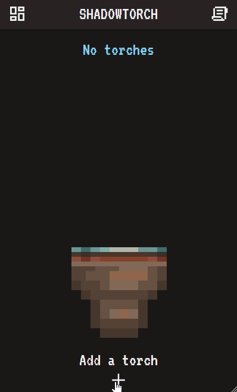

## Shadowtorch



Simple multi-torch tracker for the Shadowdark TTRPG

### Features
 - **Ambient mode** - animated torch, fire ambience w/ blowout sound, 9 app/fire themes
 - **Overview mode** - easily keep track of multiple torches (sort/pause all/decrement 10 mins)

### Development

```pnpm install``` -> ```pnpm run dev``` to start the dev server. \
Or use the Dockerfile to build and run the app. \
```docker build -t shadowtorch .``` \
```docker run --rm -p 3000:3000 shadowtorch```

### Credits

**Animated torch** was made by [NYKNCK](https://nyknck.itch.io/). \
**Fire ambience** by Mixkit provided under the [Mixkit Sound Effects Free License](https://mixkit.co/license/#sfxFree).
